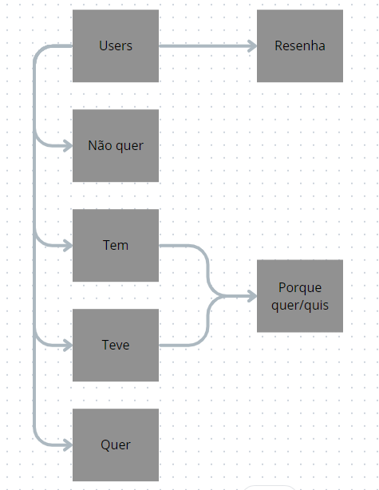

## Documentação Simplificada do Modelo Relacional

**Projeto:** Abandono Zero

**Data:** 2024-05-10

**Autor:** Lucas Ramenzoni Jorge

**Objetivo:** Descrever o modelo relacional do projeto de forma resumida e simplificada.

## Entidades

- **Usuários** (`users`): Armazena informações básicas sobre os usuários como nome, email, senha criptografada, país, estado, cidade, bairro, nome e sobrenome.

- **Formulários**
  - **Resenha** (`form_resenha`): Armazena informações detalhadas do usuário, como idade, gênero, nível de escolaridade, tipo de moradia, status familiar, renda anual, quantidade de pessoas na casa, e próximo formulário a ser preenchido.
  - **Tem** (`form_tem`): Armazena informações sobre o cão que o usuário possui, incluindo nome do cão, sexo, se é castrado, tempo com o cão, quantidade de pets, se é o primeiro cão, idade, raça, tipo de raça, origem, método de aquisição, razões para ter o cão, e considerações sobre o cão.
  - **Teve** (`form_teve`): Detalhes sobre cães que o usuário já teve, incluindo o nome do cão, tempo com o cão, detalhes sobre outros pets, idade de chegada do cão, se foi castrado, raça, tipo de raça, origem do cão, preço, e razões para a escolha do cão.
  - **Quer** (`form_quer`): Informações sobre o cão que o usuário deseja ter, como tamanho, comprimento do pelo, cor, sexo, idade, tipo de raça, razão pelo desejo, ideia de nome para o cão, e gastos esperados com o cão.
  - **Não Quer** (`form_não_quer`): Motivos pelos quais o usuário não deseja ter um cão.

- **Razões para ter cão** (`reasons_dog`): Tabela que armazena razões diversas para possuir um cão, como companhia para crianças, adultos, por aparência, ou para proteção.

## Relacionamentos

- **Usuários e Formulários**: Um usuário pode preencher múltiplos tipos de formulários dependendo de suas experiências e desejos em relação a cães.
- **Formulários e Razões**: Os formulários `form_tem` e `form_teve` podem referenciar múltiplas razões na tabela `reasons_dog`, indicando por que o usuário decidiu ter ou já teve um cão.

## Regras de Negócio

- Todos os campos obrigatórios devem ser preenchidos para garantir um registro completo das informações.
- É importante garantir que as informações sejam consistentes e precisas entre os formulários para evitar discrepâncias.
- Usuários têm permissões limitadas para editar informações para manter a integridade dos dados.
- As informações dos usuários são tratadas com confidencialidade e proteção adequadas para garantir a privacidade.

## Diagrama

Figura 1 - Modelo SQL simples 

Fonte: Material produzido pelos autores (2024)

## Considerações Finais

Este modelo relacional simplificado fornece uma base sólida para o gerenciamento eficaz das informações dos usuários e suas interações com diferentes tipos de formulários no projeto Abandono Zero. As entidades e seus relacionamentos estão desenhados para garantir organização e integridade dos dados, enquanto as regras de negócio asseguram a consistência e confiabilidade das informações coletadas.

**Observações:**

- Este documento serve como uma introdução ao modelo relacional e pode ser expandido conforme as necessidades do projeto se desenvolvem.
- Manter a documentação atualizada é crucial para o desenvolvimento e manutenção eficientes do sistema.
